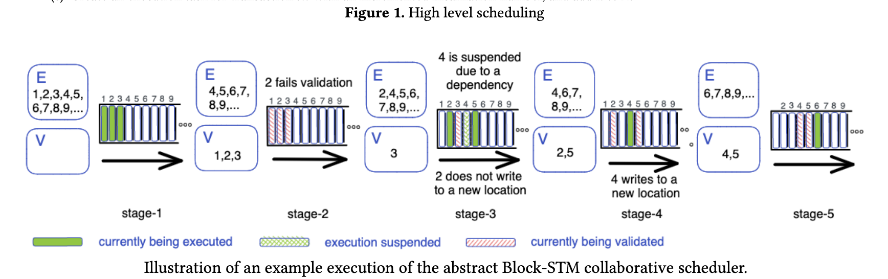
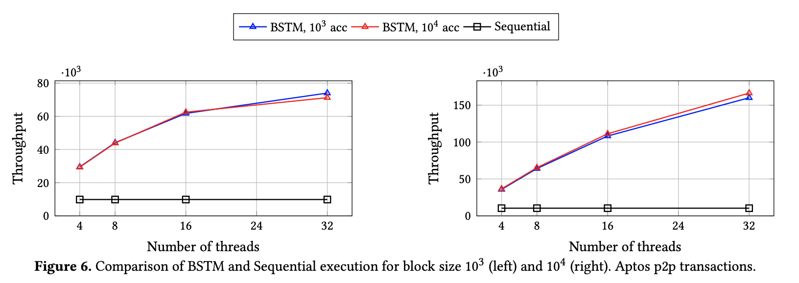

# Scaling Blockchain Execution by Turning Ordering Curse to a Performance Blessing(Block-STM∗)
## 摘要

Block-STM 是智能合约的并行执行引擎，围绕软件事务内存的原则构建。事务被分组在块中，块的每次执行都必须产生相同的确定性结果。 Block-STM 进一步强制执行结果与执行事务一致
根据预设顺序，利用该顺序动态检测依赖关系，避免推测交易执行期间的冲突。 Block-STM 的**核心是一种新颖的、低开销的执行和验证任务协作调度器**。

Block-STM 在 Diem 区块链代码库的主要分支上实现，并在 Aptos 的生产环境中运行。我们的评估表明，Block-STM 能够适应具有不同冲突率的工作负载，并利用其中固有的并行性。
Block-STM 在 Diem 基准测试中实现了高达 110𝑘 tps，在 Aptos 基准测试中实现了高达 170𝑘 tps，这分别比 32 个线程的顺序基线提高了 20 倍和 17 倍。在 Diem 和 Aptos 基准测试中，竞争工作负载的吞吐量分别高达 50𝑘 tps 和 80𝑘 tps。

## 介绍
新兴去中心化 web3 平台和应用程序面临的一个核心挑战是**提高底层区块链系统的吞吐量**。区块链系统的核心是**状态机复制(SMR)**，允许一组实体同意并应用一系列交易块。每笔交易都包含要执行的智能合约代码，并且每个执行交易块的实体都必须到达相同的最终状态。虽然在扩展系统部分方面取得了进展，但区块链仍然受到其他组件的限制，例如交易执行。

我们的目标是通过**并行加速事务的内存执行**。访问不同内存位置的事务总是可以并行执行。然而，在区块链系统中，交易可能会有大量的访问冲突。这可能是由于潜在的性能攻击、访问流行的合约或由于经济机会（例如拍卖和套利 [16]）而发生的。

冲突是性能的主要挑战。**软件事务内存 (STM)** 库 [29, 44] 开创的一种方法是检测内存访问以检测冲突。具有**乐观并发控制** [17] (OCC) 的 STM 库记录内存访问，**在执行后验证每个事务，并在验证出现冲突时中止并重新执行事务。最终结果相当于以某种顺序依次执行事务。这种等价的顺序称为序列化**。

先前的工作 [5, 8, 18] 已经利用区块链用例的细节来提高 STM 性能。他们的方法是以交易的有向无环图的形式预先计算依赖关系，可以通过分叉连接计划执行。生成的调度是依赖感知的，并避免了相应的冲突。如果激励实体记录和共享依赖图，那么一些实体可能能够避免预计算开销。

在确定性数据库的上下文中，Bohm [21] 展示了一种避免预先计算依赖图的方法。Bohm 假设所有事务的写入集在执行之前都是已知的，并强制执行特定的预设序列化事务。因此，每次读取都与按该顺序在其前面的最后一次写入相关联。使用**多版本数据结构 [10](MVCC)**，Bohm 在读取依赖关系解决时执行事务，避免相应的冲突。

我们的贡献。我们展示了 Block-STM，这是一种***基于乐观控制 STM 原则构建的内存中智能合约并行执行引擎***。 Block-STM 不需要事务写入集的先验知识，避免预计算，并在不需要进一步通信的情况下自动加速事务执行。与 Bohm 类似，Block-STM 使用多版本共享数据结构并强制执行预设序列化。最终的结果相当于交易按照它们在区块中出现的预设顺序顺序执行。

关键的观察是，使用 OCC 和预设的序列化，当事务中止时，它的写入集可用于有效地检测未来的依赖关系。这相对于预执行有两个优点：（1）在冲突很少的乐观情况下，大多数事务执行一次，（2）否则，写集可能更准确，因为它们基于更多最新的执行。预设顺序的另一个优点是，它允许进行与顺序执行输出相比的全面的正确性测试。

以下是有助于 Block-STM 在区块链环境中的性能的两个观察结果。首先，在区块链系统中，状态是按区块更新的。这允许 Block-STM 避免单独提交事务的同步成本。相反，Block-STM 基于两个原子计数器和双重收集技术 [9] 延迟提交块中的所有事务。其次，交易以智能合约语言指定，例如 Move [11] 和 Solidity [51]，并在封装其执行并确保安全行为的虚拟机中运行。因此，不透明度[24]非必要，允许 Block-STM 有效地将**乐观并发控制与多版本数据结构**相结合，而无需额外的机制来避免达到不一致的状态。

结合 OCC 和预设序列化的主要挑战是验证不再相互独立，并且必须在逻辑上按顺序发生。事务验证失败意味着所有更高级别的事务只有在之后成功验证后才能提交。 Block-STM 通过一种新颖的协作调度程序来处理这个问题，该调度程序乐观地调度执行和验证任务，为预设顺序中较低的事务优先处理任务。虽然并发优先级队列众所周知难以跨线程扩展 [4, 40]，但 Block-STM 利用预设的序列化顺序和事务索引的有界性，仅使用几个共享原子计数器来实现并发有序集抽象。

我们为 Safety 和 Liveness 提供了全面的正确性证明，证明不存在死锁或活锁，并且最终状态始终等同于顺序执行事务产生的状态。

Block-STM 的 Rust 实现被合并到 Diem [47] 及其继任者 Aptos [2] 开源区块链代码库 [1, 3] 的主要分支上。实验评估表明，Block-STM 在低争用工作负载上优于顺序执行高达 20 倍，在高争用工作负载上高达 9 倍。重要的是，当工作负载完全顺序时，BlockSTM 最多会承受 30% 的开销。此外，Block-STM 显着优于最先进的确定性 STM [52] 实现，并且性能接近于在执行之前需要完美的写入集信息的 Bohm。

本文的其余部分组织如下：第 2 节提供了 Block-STM 的高级概述。第 3 节描述了完整的算法，而第 4 节描述了 BlockSTM 的实现和评估。第 5 节讨论了相关工作，第 6 节总结了本文。附录 A 包含全面的正确性证明。

## 概述
Block-STM的输入是一个交易块，用BLOCK表示，包含𝑛交易，它定义了预设的序列化顺序𝑡𝑥1 < 𝑡𝑥2 < ... < 𝑡𝑥𝑛。问题定义是执行区块并产生最终状态等价于按顺序执行交易产生的状态𝑡𝑥1，𝑡𝑥2，...。 . .𝑡𝑥𝑛，每个𝑡𝑥𝑗在𝑡𝑥𝑗+1开始之前执行到完成。目标是利用可用线程尽可能高效地产生这种最终状态。

Block-STM 中的每个事务可能会执行多次，我们将𝑖𝑡ℎ 执行称为事务的化身 𝑖。当系统决定需要使用递增的化身号重新执行时，我们说化身被中止。版本是一对交易索引和化身号。为了支持可能并发执行的事务的读取和写入，Block-STM 维护了一个内存中的多版本数据结构，该结构为每个内存位置分别存储每个事务写入的最新值以及相关的事务版本。当事务𝑡𝑥读取内存位置时，它会从多版本数据结构中获取按预设序列化顺序出现在𝑡𝑥之前的最高事务写入该位置的值以及相关版本。例如，事务𝑡𝑥5 可以读取事务𝑡𝑥3 写入的值，即使事务𝑡𝑥6 已写入相同的位置。如果没有较小的事务写入某个位置，则读取（例如，𝑡𝑥1 的所有读取）将根据块执行前的状态从存储中解决。

对于每个化身，Block-STM 维护一个写集和一个读集。读取集包含在化身期间读取的内存位置以及相应的版本。写集将化身所做的更新描述为（内存位置，值）对。化身的写入集在执行结束时应用于共享内存（多版本数据结构）。在化身执行之后，它需要通过验证。验证重新读取读取集并比较观察到的版本。直观地说，成功的验证意味着化身应用的写入仍然是最新的，而失败的验证意味着必须中止化身。

检查完成：如果𝑉和𝐸为空并且没有其他线程正在执行任务，则返回。
查找下一个任务：执行 𝑉 和 𝐸 中事务索引 𝑡𝑥 最小的任务：
1.执行任务：执行𝑡𝑥的下一个化身。如果读取了标记为估计的值，则中止执行并将𝑡𝑥 添加回𝐸。否则：
(a) 如果有写入到内存位置，而之前完成的 𝑡𝑥 没有写入，则为当前不在 𝐸 或正在执行的所有事务 ≥ 𝑡𝑥 创建验证任务，并将它们添加到 𝑉。
(b) 否则，仅为 𝑡𝑥 创建一个验证任务并将其添加到 𝑉 。
2. 验证任务：验证𝑡𝑥的最后一个化身。如果验证成功，则继续。否则，中止：
(a) 将化身（验证失败）写入的每个值（在多版本数据结构中）标记为估计值。
(b) 为当前不在 𝐸 或正在执行的所有交易 > 𝑡𝑥 创建验证任务，并将它们添加到 𝑉。
(c) 为事务 𝑡𝑥 创建一个执行任务，其化身号递增，并将其添加到 𝐸。

**图 1. 高级调度**

最初，所有交易都在有序集合𝐸中。在这个例子中，交易𝑡𝑥4 依赖于𝑡𝑥2。在第一阶段，由于没有验证任务，线程并行执行事务𝑡𝑥1、𝑡𝑥2、𝑡𝑥3。然后，在第 2 阶段，线程并行验证交易𝑡𝑥1、𝑡𝑥2、𝑡𝑥3，𝑡𝑥2 验证失败，𝑡𝑥1 和𝑡𝑥3 验证成功。 𝑡𝑥2 的化身被中止，它的每次写入都被标记为多版本数据结构中的估计，下一个化身任务被添加到𝐸，并且𝑡𝑥3 的新验证任务被添加到𝑉。在第 3 阶段，交易𝑡𝑥3 被验证，交易𝑡𝑥2 和𝑡𝑥4 开始执行它们各自的化身。然而，𝑡𝑥4 的执行读取一个标记为估计的值，由于对𝑡𝑥2 的依赖而中止，线程执行𝐸中的下一个事务，即𝑡𝑥5。如上所述，𝑡𝑥4 被记录为𝑡𝑥2 的依赖项，并在𝑡𝑥2 的化身完成时添加回𝐸。在 𝑡𝑥2 和 𝑡𝑥5 都完成执行后，将相应的验证任务添加到 𝑉 中。在此示例中，𝑡𝑥2 的化身不会写入其先前的化身未写入的内存位置。因此，不需要再次验证𝑡𝑥3。在第 4 阶段，𝑡𝑥2 和𝑡𝑥5 成功验证并执行𝑡𝑥4。从此时起，𝑡𝑥1、𝑡𝑥2 和𝑡𝑥3 将永远不会被重新执行，因为在𝑉 或𝐸 中没有与它们关联的任务（并且没有与更高事务关联的任务可能导致创建它）。 𝑡𝑥4 的执行写入一个新的内存位置，因此将𝑡𝑥5 添加到𝑉 以进行重新验证。在第 5 阶段，交易𝑡𝑥4 和𝑡𝑥5 被验证，交易𝑡𝑥6 被执行。

**依赖估计**。 Block-STM 不预先计算依赖关系。相反，对于每个事务，Block-STM 将中止化身的写入集视为对下一个写入集的估计。与多版本数据结构和预设顺序一起，它可以通过有效地检测潜在的依赖关系来降低中止率。
当化身由于验证失败而中止时，多版本数据结构中与其写入集相对应的条目将替换为特殊的估计标记。这意味着估计下一个化身将写入相同的内存位置。特别是，事务 𝑡𝑥𝑗 的化身在读取标记为由较低事务 𝑡𝑥𝑘 写入的估计值时停止并立即中止。这是一种优化，可以在将来由于验证失败而中止一个化身时提前中止它，如果𝑡𝑥𝑘的下一个化身确实会写入相同的位置（未覆盖的 ESTIMATE 标记是被下一个化身移除）。

**协作调度器**。 Block-STM 引入了一个协作调度器，它在线程之间协调验证和执行任务。预设的序列化顺序规定事务必须按顺序提交，因此化身的成功验证并不能保证它可以提交。这是因为块中较早交易的中止和重新执行可能会使化身读取集无效并需要重新执行。
因此，当交易中止时，所有更高的交易都被安排重新验证。相同的化身可能会被不同的线程多次验证，并且可能是并行的，但是 Block-STM 确保每个版本只有第一次中止成功（其余的被忽略）。

由于事务必须按顺序提交，BlockSTM 调度程序优先考虑与低索引事务相关的任务（验证和执行）。接下来，我们概述了该方法背后的高级思想。详细逻辑在第 3 节中描述，并在附录 A 中正式证明。

抽象地说，Block-STM 协作调度器跟踪待处理验证任务的有序集𝑉和待处理执行任务的有序集𝐸。最初，𝑉 是空的，𝐸 包含块中所有交易的初始化身的执行任务。交易𝑡𝑥∉𝐸当前正在执行或（它的最后一个化身）已经完成。在高层次上，每个线程都重复图 1 中描述的指令。

当一个事务𝑡𝑥𝑘读取一个由𝑡𝑥𝑗写的ESTIMATE标记（其中𝑗 < 𝑘）时，我们说𝑡𝑥𝑘遇到依赖。我们将𝑡𝑥𝑘视为𝑡𝑥𝑗的依赖项，因为它的读取取决于估计𝑡𝑥𝑗要写入的值。为了便于演示，在上面的描述中，在遇到依赖项时立即将事务添加回𝐸。
然而，如第 3 节所述，Block-STM 实现了一个稍微复杂的机制。事务 𝑡𝑥𝑘 首先被单独记录为 𝑡𝑥𝑗 的依赖项，并且仅在 𝑡𝑥𝑗 的下一个化身完成时（即当依赖项解决时）才添加回 𝐸。

有序集 𝑉 和 𝐸 分别通过单个原子计数器和跟踪事务状态的机制来实现，即给定事务是否准备好验证或执行。为了选择一个任务，线程递增这些计数器中较小的一个，直到它们找到准备好执行的任务。要为事务𝑡𝑥添加（验证或执行）任务，线程会更新状态并将相应的计数器减少到𝑡𝑥（如果它具有更大的值）。出于演示目的，上述描述省略了 BlockSTM 调度程序在情况 1(b) 和 2(c) 中使用的优化，其中不是减少计数器值，而是返回新任务。

**乐观验证**。事务的化身可能会根据预设的序列化顺序写入先前由更高事务的化身读取的内存位置。这就是为什么在 1(a) 中，当化身完成时，会为更高的交易创建新的验证任务。重要的是，验证任务被乐观地安排，例如可以同时验证交易的最新版本𝑡𝑥𝑗、𝑡𝑥𝑗+1、𝑡𝑥𝑗+2 和𝑡𝑥𝑗+4。假设交易𝑡𝑥𝑗、𝑡𝑥𝑗+1 和𝑡𝑥𝑗+4 验证成功，而𝑡𝑥𝑗+2 验证失败。当线程可用时，Block-STM 通过并行执行这些验证来利用，使其能够在上述示例中更快地检测到𝑡𝑥𝑗+2 的验证失败（以需要重做的𝑡𝑥𝑗+4 验证为代价）。尽快识别验证失败和中止化身对于系统性能至关重要，因为读取由中止的化身写入的值的任何化身也需要中止，形成一连串的中止。

当一个化身仅写入由同一事务的先前完成的化身写入的内存位置子集时，即案例 1(b)，Block-STM 仅为该化身安排验证。由于 2(a)，这就足够了，因为前一个化身的整个写入集在中止期间被标记为估计值。中止导致乐观地为 2(b) 中的更高交易创建验证任务。由于内存位置上的估计标记，执行这些任务的线程已经可以检测到验证失败，而不是等待后续的化身完成。

提交规则。在 [23] 中，我们推导出了一个精确的谓词，用于确定何时可以将事务𝑡𝑥𝑗 视为已提交（大致是在较低事务 0、...、𝑗 - 1 已经提交后成功验证化身时）。可以连续跟踪该谓词，但为了减少所涉及的工作量和同步，Block-STM 调度程序仅检查是否可以提交整个事务块。这是通过观察没有更多任务要执行并且同时没有线程正在执行任何任务来完成的。

## Block-STM 详细说明
在本节中，我们将描述 Block-STM。生成后，线程执行第 1 行中的 run() 过程。我们的伪代码分为线程使用的几个模块。 Scheduler 模块包含用于分派执行和验证任务的共享变量和逻辑。 MVMemory 模块包含多版本数据结构形式的共享内存，用于 Block-STM 中不同事务写入和读取的值。最后，VM 模块描述了在事务执行期间如何检测读取和写入。

当所有线程从 run() 调用返回后加入时，Block-STM 完成。此时，可以通过调用 MVMemory.snapshot() 函数获得 BlockSTM 的输出，该函数返回所有受影响内存位置的最终值。这个函数可以很容易地并行化，并且输出可以持久化到主存储（抽象为一个 Storage 模块），但是这些方面超出了这里的范围。

### 高级线程逻辑
我们从算法 1 中描述的高级逻辑开始。run() 过程与调度程序模块接口，并由一个循环组成，该循环允许调用线程连续执行可用的验证和执行任务。线程在第 9 行查找新任务，并根据其类型分派适当的处理程序，即第 5 行中的函数 try_execute 用于 EXECUTION_TASK，第 7 行中的函数 needs_reexecution 用于 VALIDATION_TASK（因为如第 2 节所述，成功验证不会改变状态，而失败的验证意味着事务需要重新执行）。这两个函数都将交易版本（交易索引和化身号）作为输入。 try_execute 函数调用可能会向调用者返回一个新的验证任务，而 needs_reexecution 函数调用可能会返回一个新的执行任务。

**执行任务**。使用 try_execute 过程处理执行任务。首先，在第 12 行调用了一个 VM.execute 函数。如第 3.2.1 节所述，根据 VM 设计，该函数从内存（MVMemory 数据结构和主存储）中读取，但在执行时从不修改任何状态.相反，成功的 VM 执行会返回一个写入集，由内存位置及其更新值组成，通过第 18 行中的记录函数调用将其应用于 MVMemory。在 Block-STM 中，VM.execute 还捕获并返回一个读取- set，包含在化身期间读取的所有内存位置，每个位置都与一个值是从 MVMemory 还是从 Storage 读取相关联，在前一种情况下，是先前写入该值的事务执行的版本。读取集也被传递给第 18 行中的 MVMemory.record 调用，并存储在 MVMemory 中以供以后验证。

每个 MVMemory.record 调用都会返回一个指示符，是否发生了对同一事务的前一个化身未写入的内存位置的写入。如第 2 节所述，在 Block-STM 中，该指示符确定更高的事务（比刚刚完成执行，按照预设的序列化顺序）需要进一步验证。第 19 行的 Scheduler.finish_execution 调度所需的验证任务。当没有写入新位置时，written_new_location 变量设置为 false，仅验证事务本身就足够了。在这种情况下，由于内部性能优化，调度程序模块有时会将此验证任务从 finish_execution 调用返回给调用方。

事务𝑡𝑥𝑗的VM执行可能会按照预设顺序观察到对较低事务𝑡𝑥𝑘的读取依赖，𝑘 <𝑗。如第 2 节所述，当 𝑡𝑥𝑘 的最后一个化身写入 𝑡𝑥𝑗 读取的内存位置，但是当 𝑡𝑥𝑘 的化身在 𝑡𝑥𝑗 读取之前中止时，就会发生这种情况。在这种情况下，阻塞事务的索引 𝑘 作为 vm_result.blocking_txn_idx 返回，它是第 12 行输出的一部分。为了在阻塞事务 𝑡𝑥𝑘 完成下一个化身后重新调度 𝑡𝑥𝑗 的执行任务，调度程序.add_dependency 在第 14 行被调用。如果在可以添加依赖项之前重新执行𝑡𝑥𝑘 时遇到竞争条件，此函数将返回 false。然后在第 15 行立即重试执行任务。

**验证任务**。第 22 行中的 Avalidate_read_set 调用获取通过执行 txn_idx 记录的最后一个读取集，并检查重新读取读取集中的每个内存位置是否仍然产生相同的值。更准确地说，对于读取的每个值，读取集存储一个读取描述符。此描述符包含事务的版本（在执行期间写入值），或者如果值是从存储中读取的（即不是由较小的事务写入），则为 ⊥。化身数是单调递增的，因此通过比较相应的描述符来验证读取集就足够了。

如果验证失败，则在第 23 行调用 Scheduler 上的 try_validation_abort，返回是否成功中止的指示符。调度程序确保每个版本只有一个失败的验证可能导致成功中止。因此，如果 abort_validation 返回 false，则化身已经中止。如果中止成功，则调用第 25 行中的 convert_writes_to_estimates(txn_idx)，它用特殊的 ESTIMATE 标记替换共享内存数据结构中中止版本的写入集。成功的中止会导致在第 26 行的 Scheduler.finish_validation 调用期间安排重新执行的事务和用于验证的更高事务。

有时，（作为一种优化），重新执行任务被返回（继续从 needs_reexecution 返回新版本，然后在第 5 行成为执行事务的下一个化身的唯一线程）。

## 多版本内存
MVMemory 模块（算法 2）描述了 Block-STM 中的共享内存数据结构。它被称为多版本，因为它为每个内存位置存储多个写入，以及相应事务的值和关联版本。在伪代码中，我们用抽象的映射接口表示主要的数据结构，称为数据，将 (location, txn_idx) 对映射到相应的条目，即 (incarnation_number, value) 对。为了支持事务𝑡𝑥𝑗对内存位置的读取，data 提供了一个接口，该接口返回由具有最高索引𝑖的事务在位置写入的条目，使得𝑖 < 𝑗 在第 48 行和第 51 行中使用了此功能。为了清楚起见在介绍中，我们的伪代码专注于地图的抽象功能，而标准的并发数据结构设计技术可用于高效实现（在第 4 节中讨论）。

对于每个事务，MVMemory 在 last_written_locations 数组中存储一组内存位置，在 last_read_set 数组中存储一组 (location, version) 对。我们假设这些集合是以原子方式加载和存储的，这可以通过存储指向集合的指针并以原子方式访问指针来完成，即通过读取-复制-更新[33]。

**记录**。记录函数采用事务版本以及读取集和写入集（由版本的执行产生）。写入集由（内存位置，值）对组成，这些对通过 apply_write_set 过程调用应用于数据映射。在第 40 行中对 rcu_update_written_locations 的调用更新了 last_written_locations 并从数据映射中删除（在第 33 行中）未被事务的最新写入集覆盖的内存位置的所有条目（即之前的 last_written_locations 中的位置，但不是在更新之后）。此函数还确定并返回是否写入了新的内存位置（即在 last_written_locations 之后，但不是在更新之前）。该指标存储在written_new_location 变量中并从记录函数返回。在返回之前，事务的读取集通过 RCU 指针更新存储在 last_read_set 数组中。

在事务中止期间调用的 convert_writes_to_estimates 过程会迭代事务的 overlast_written_locations，并用特殊的 ESTIMATE 标记替换每个存储的 (incarnation_number, value) 对。如果它们已读取由中止的化身写入的数据，它可以确保更高事务的验证失败。虽然删除条目也可以完成此操作，但 ESTIMATE 标记还用作此事务的下一个化身的“写入估计”。任何在推测执行期间读取时观察到事务𝑡𝑥 ESTIMATE 的事务，等待依赖关系解决（𝑡𝑥 被重新执行），而不是忽略 ESTIMATE 并且如果 𝑡𝑥 的下一个化身再次写入相同的内存位置可能会中止。

**读**。 MVMemory.read 函数将内存位置和事务索引 txn_idx 作为其输入参数。首先，它在低于 txn_idx 且已写入此内存位置的事务中查找最高事务索引 idx（第 48 行和第 51 行）。基于区块中交易的固定序列化顺序，这是推测读取的最佳猜测（低于idx的交易写入会被idx覆盖，推测的前提是idx和txn_idx之间的交易不写到同一个内存位置）。事务 idx 写入的值在第 54 行返回，以及完整版本（即 idx 和化身号）和 OK 状态。但是，如果与事务 idx 对应的条目是 ESTIMATE 标记，则读取将返回 READ_ERROR 状态，并将 idx 作为阻塞事务索引。这指示调用者推迟事务 txn_idx 的执行，直到阻塞事务 idx 的下一个化身完成。本质上，此时，估计事务 idx 将执行与事务 txn_idx 正确执行相关的写入。

当没有较低的事务写入内存位置时，读取会返回 NOT_FOUND 状态，这意味着无法从块中的先前事务中获取该值。正如我们稍后将描述的，调用者可以通过从存储中读取来完成推测性读取。

validate_read_set 函数从第 63 行的事务执行中加载（通过 RCU）最近记录的读取集。该函数为每个位置调用 read 并根据读取集检查观察到的状态和版本（回忆一下版本 ⊥ 在 read- set 表示相应的先前读取返回 NOT_FOUND 状态，即它从 Storage 读取值）。正如我们在 3.1.2 节中看到的，validate_read_set 函数在第 22 行的验证期间被调用，此时正在验证的化身已经执行并记录了读取集。但是，如果为事务的化身 𝑖 执行验证任务的线程很慢，则 validate_read_set 函数调用可能会观察到稍后（即 > 𝑖）化身记录的读取集。在这种情况下，保证化身𝑖已经被中止（否则更高的化身永远不会开始），并且无论结果如何，验证任务都不会对系统产生影响（只有成功中止的验证会影响状态，并且每个化身都可以最多中止一次）。

快照函数在 Block-STM 完成后调用，并返回某个事务写入的每个位置的最高事务写入的值。

### VM 执行
在算法 3 中，我们描述了如何在 Block-STM 中由 VM.execute 函数（在执行执行任务时调用，在第 12 行中调用）处理读取和写入。该函数跟踪并返回事务的读集和写集，均初始化为空。当一个事务试图将一个值写入一个位置时，(location, value) 对被添加到写入集中，可能用先前的值替换一对（如果这不是事务在此期间第一次写入该位置）执行）。

当一个事务尝试读取一个位置时，如果该位置已经在写入集中，则 VM 在第 85 行读取相应的值（事务本身写入的值）。否则，执行 MVMemory.read。如果它返回 NOT_FOUND，则 VM 直接从存储中读取值（抽象为存储模块，其中包含块执行之前的值）并在读取集中记录（位置，⊥）。如果 MVMemory.read 返回 READ_ERROR，则 VM 执行停止并将错误和阻塞事务索引（用于依赖项）返回给调用者。如果返回 OK，则 VM 从 MVMemory 中读取结果值，并在读取集中记录位置和版本对。

请注意，为简单起见，如果事务多次读取同一位置，则伪代码重复读取并在读取集中单独记录。即使读取相同的位置会导致读取不同的值，Block-STM 算法也会保持正确性，因为最终会验证所有读取，并且 VM 会捕获由于任何不透明度违规而可能出现的错误。

## 调度
Scheduler 模块包含管理执行和验证任务所需的状态和同步逻辑。对于块中的每个事务，txn_status 数组包含最新的化身编号（最初为 0）和此化身的状态，可以是 READY_TO_EXECUTE（初始值）、EXECUTING、EXECUTED 和 ABORTING 之一。 txn_status 数组的条目受锁保护以提供原子性。

状态转换如图 2 所示。当化身号为 𝑖 时，在第 114 行将状态从 READY_TO_EXECUTE 更改为 EXECUTING 的线程执行事务的化身 𝑖。状态永远不会再次变为 READY_TO_EXECUTE(i)，保证不会多次执行化身。之后，该线程在第 166 行将状态设置为 EXECUTED(i)。类似地，只有将状态从 EXECUTED(i) 更改为 ABORTING(i) 的线程才会从 try_validation_abort 返回 true 以实现化身𝑖。在执行与成功中止相关的步骤后，如第 3.1.2 节所述，该线程随后在第 158 行将状态更新为 READY_TO_EXECUTE(i + 1)。这表明化身𝑖 + 1 的执行任务已准备好创建的。

当事务 𝑡𝑥𝑘 的化身 𝑖 由于对事务 𝑡𝑥𝑗 的读取依赖而中止时（在预设的序列化顺序中𝑗 < 𝑘），𝑡𝑥𝑘 的状态在第 151 行更新为 ABORTING(i)。相应的 add_dependency(k, j) 调用返回 true 并且 Block-STM 保证某个线程随后将完成执行事务𝑡𝑥𝑗，并通过将其状态设置为 READY_TO_EXECUTE(i + 1) 来解决 𝑡𝑥𝑘 在第 158 行（从第 161 行调用）中的依赖关系。

txn_dependency 数组用于跟踪交易依赖关系。在上面的例子中，当交易𝑡𝑥𝑘读取交易𝑡𝑥𝑗的估计并调用add_dependency(k, j)（返回true）时，𝑘在第152行被添加到txn_dependency[j]。我们的伪代码明确描述了基于锁的同步存储在 txn_dependency 数组中的依赖项。这是为了演示处理𝑡𝑥𝑘的add_dependency函数和𝑡𝑥𝑗的finish_execution过程之间的竞争（特别是为了保证事务𝑡𝑥𝑗总是在第167行清除它的依赖关系）。如果在 𝑡𝑥𝑘 观察到读取依赖项之后，事务 𝑡𝑥𝑗 跑到 finish_execution 并清除其依赖项，则可能会出现问题场景。但是，由于第 149 行中的检查，不会添加依赖项，并且 add_dependency 调用将返回 false。然后，𝑡𝑥𝑘的状态将保持为 EXECUTING ，调用者将立即在第 15 行重新尝试 𝑡𝑥𝑘 的执行任务，化身 𝑖。

**管理任务**。 Block-STM 调度程序维护 execution_idx 和 validation_idx 原子计数器。一起，可以将状态数组和验证（或执行）索引计数器视为有序集合抽象的基于计数的实现，用于选择索引最低的可用验证（或执行）任务。

validation_idx 计数器跟踪要验证的下一个事务的索引。线程通过对 validation_idx 执行 fetch_and_increment 指令，在 next_version_to_validate 函数的第 130 行选取一个索引。然后它检查具有相应索引的事务是否已准备好进行验证（即状态为 EXECUTED），如果是，则确定最新的化身号。类似的 execution_idx 计数器与状态数组结合使用来管理执行任务。在 next_version_to_execute 函数中，线程在第 123 行通过 fetch_and_incrementing 选择索引，然后调用 try_incarnate 函数。只有当事务处于 READY_TO_EXECUTE 状态时，该函数才会将状态设置为 EXECUTING 并返回相应的版本执行。

当事务状态更新为 READY_TO_EXECUTE 时，Block-STM 确保最终创建相应的执行任务。在 resume_dependencies 过程中，执行索引被第 164 行中的调用减少到不高于已解决依赖关系的所有事务的索引。然而，在成功中止后的 finish_validation 函数中，可能有一个重新执行的任务（除非在设置状态后该任务已经被另一个线程声明，在第 188 行检查过该任务）。作为一种优化，执行任务有时会在第 189 行返回给调用者，而不是减少 execution_idx。

类似地，如果交易 𝑡𝑥𝑘 的验证成功中止，则 Block-STM 在 finish_validation 函数（第 185 行）中确保validation_idx ≤ 𝑘。此外，在事务𝑡𝑥𝑘 的 finish_execution 函数中，如果关联的化身写入了新的内存位置，BlockSTM 在第 171 行调用 reduction_validation_idx。否则，只会创建 𝑡𝑥𝑘 的验证任务，该任务可能会返回给调用者。

最后，next_task 函数通过比较第 138 行中的两个索引，根据简单的启发式方法决定是获取要执行的版本还是要验证的版本。

**检测完成**。调度程序为线程提供了一种机制来检测所有执行和验证任务何时完成。这不是微不足道的，因为单个线程可能无法从 next_task 函数获得可用任务，但稍后仍可以创建更多执行和验证任务，例如如果另一个线程正在执行的验证任务失败。

Block-STM 实现了一个 check_done 过程，该过程确定所有工作何时完成并且线程可以安全返回。在这种情况下，done_marker 设置为 true，为所有线程在第 3 行退出其主循环提供了一种廉价的方式。线程在第 120 行和第 127 行调用 check_done 过程，当观察到已经≥的执行或验证索引时 BLOCK.size()。下面，我们解释一下check_done背后的逻辑。

一个稻草人方法是检查执行和验证索引是否至少与 BLOCK.size() 一样大。这种方法的第一个问题是它没有考虑执行和验证任务何时真正完成。例如，validation_idx 可能在第 130 行增加并变为 BLOCK.size()，但线程返回是不正确的，因为事务 BLOCK.size() - 1 的相应验证任务仍然可能失败。为了克服这个问题，Block-STM 利用 num_active_tasks 原子计数器来跟踪正在进行的执行和验证任务的数量。然后，除了索引之外，调度程序还在第 108 行检查是否 num_active_tasks = 0。

num_active_tasks 计数器在第 122 行和第 129 行中递增，就在 execution_idx 和 validation_idx 分别被获取和递增之前。如果没有创建与获取的索引对应的任务（第 116 行和第 135 行），或者在任务完成后（第 174 行和第 190 行），则 num_active_tasks 递减。作为一种优化，当 finish_execution 或 finish_validation 函数将新任务返回给调用者时，num_active_tasks 保持不变（而不是递增和递减取消）。

第二个挑战是validation_idx、execution_idx 和num_active_tasks 是单独的计数器，例如可以读取validation_idx 的值为BLOCK.size()，然后读取num_active_tasks 的值为0，而这些变量不会同时保存各自的值。 Block-STM 通过另一个计数器来处理这个问题，reduce_cnt，在 reduction_execution_idx 和 reduction_validation_idx 过程中递增（第 100 行，第 105 行）。通过在 check_done 中读取 reduction_cnt 两次，当 num_active_tasks 被读取为 0 时，可以检测验证或执行索引是否从观察值下降。

## 实施与评估
我们的 Block-STM 实现在 Rust 中，并合并到开源 Diem 和 Aptos 项目 [2, 47] 的主分支中。两个区块链都以 Move 语言运行智能合约的虚拟机 [11]。 VM 捕获所有可能源于推测事务执行期间的不一致读取的执行错误。 VM 还缓存来自 Storage 的读取。重要的是，预设顺序允许我们通过与顺序实现输出进行比较来测试正确性。

Diem VM 不支持在遇到读取依赖项时暂停事务执行。相反，当事务由于 READ_ERROR 而中止时，稍后（在解决依赖关系之后）会从头开始重新启动。 Aptos VM 支持此功能。

为了减轻从头开始重新启动 VM 执行的影响，我们在第 12 行的 VM.execute 调用之前检查前一个化身的读取集是否存在依赖关系。

Block-STM 中实现的另一个相关优化发生在第 14 行的 Scheduler.add_dependency 调用返回 false 时。这表明依赖关系已解决。而不是第 15 行（这将使用 Diem VM 从头开始​​执行），Block-STM 从 VM 本身调用 add_dependency，因此可以在返回 false 时重新读取并继续执行。

Block-STM 实现使用标准缓存填充技术来减少错误共享。 num_active_tasks 的逻辑是使用资源获取即初始化 (RAII) 设计模式实现的。最后，Block-STM 将 MVMemory 中的数据映射实现为访问路径上的并发哈希映射，并使用锁定保护的搜索树实现基于 txn_idx 的高效查找。

### 实验结果

我们在带有 Ubuntu 18.04 操作系统的 Amazon Web Services c5a.16xlarge 实例（AMD EPYC CPU 和 128GB 内存）上评估了 Block-STM。实验在具有多达 32 个物理内核的单个插槽上运行，无需超线程。

评估基准执行整个区块，包括在 Move 中实现的点对点 (p2p) 交易。每个 p2p 交易随机选择两个不同的账户并进行支付。

我们首先使用 Diem p2p 事务 1 进行实验，执行 21 次读取和 4 次写入。对于从账户 𝐴 到账户 𝐵 的 Diem p2p 交易，交易的 4 次写入涉及更新 𝐴 和 𝐵 的余额和序列号。 21 次读取的原因是，每个 Diem 交易都会根据一些链上信息进行验证，以决定是否应该处理该交易，其中一些是特定于 p2p 交易的。在这个过程中，会读取正确的出块时间、账户是否被冻结等信息。

我们还对 Aptos p2p 事务 2 进行了实验，每个事务执行 8 次读取和 5 次写入，其中 Aptos p2p 事务减少了上述许多验证和链上读取。与单个 Aptos p2p 相比，单个 Diem p2p 的 VM 执行开销约为 100%，如图 3 和图 6 所示，顺序执行 Diem 和 Aptos p2p 事务的吞吐量分别约为 5𝑘 和 10𝑘。我们试验了 103 和 104 个交易的块大小以及 2、10、100、103 和 104 的帐户数量。账户的数量决定了冲突的数量，特别是只有 2 个账户的负载本质上是顺序的（每笔交易都依赖于前一笔交易）。每个数据点是 10 次测量的平均值。

报告的测量包括从存储读取所有所需值的成本，并计算输出（即所有受影响的路径和最终值），但不将输出持久化到存储。输出根据 MVMemory.snapshot 逻辑计算，但并行化（每个受影响的内存位置）。

我们将 Block-STM 与 Bohm [21] 和 LiTM [52] 进行比较。 Bohm 是一个确定性数据库引擎，它通过假设事务的写入集已知来强制执行预设顺序。 Bohm 有一个预执行阶段，在此阶段它使用 writesets 信息来构建多版本数据结构，在区块链用例中，预先知道所有 writesets 的假设是不现实的，因此我们人为地将 Block-STM 与 Bohm 进行比较为 Bohm 提供完美的 writesets 信息。请注意，我们对 Bohm 的测量仅包括并行执行，但不包括 write-sets 分析，因此在 write-sets 分析时间不可忽略时，在实践中将明显优于 Bohm 的性能。 LiTM [52] 是一个最近的确定性 STM 库，声称在基于问题的基准套件 [45] 上优于其他确定性 STM 方法。我们在第 5 节中更详细地描述了 LiTM。为了有一个统一的比较设置，我们在 Diem 区块链中用 Rust 实现了 Bohm 3 和 LiTM 4 的变体。

Block-STM 与 Diem p2p 事务的 Bohm、LiTM 和顺序基线的比较如图 3 所示。Block-STM 与 Aptos p2p 事务的顺序基线的比较如图 6 所示。我们将开源我们所有的实现和基准以实现可重复的结果。

**与 Bohm [21] 的比较**。结果表明，BlockSTM 在大多数情况下具有与 Bohm 相当的吞吐量，并且在 32 个线程和 103 个块大小时明显更好。由于 Bohm 依赖于完美的 write-sets 信息，因此所有事务之间的完美依赖关系，它可以在事务的所有依赖关系都已执行后延迟事务的执行，从而避免中止和重新执行的开销。相反，Block-STM 在执行之前不需要有关写入依赖项的信息，因此会导致中止和重新执行。尽管如此，Block-STM 的性能与 Bohm 相当，这意味着 Block-STM 的中止率非常小，这要归功于运行时写入集估计和低开销的协作调度器。我们还发现，与 Block-STM 相比，构建 Bohm 的多版本数据结构的开销显着，没有它，Bohm 的吞吐量将略好于 Block-STM。

**与 LiTM [52] 的比较**。 BlockSTM 拥有 104 个账户，无论块大小或交易类型（标准或简化）如何，其速度都比 LiTM 快 3-4 倍。使用 103 个帐户，加速比 LiTM 更大（高达 25 倍），证实 Block-STM 对冲突不太敏感。

**与顺序执行的比较**。对于 Diem 和 Aptos 基准，Block-STM 在低竞争下几乎完美地扩展，达到 90𝑘 tps 和 160𝑘 tps，分别是顺序执行的 18 倍和 16 倍。

**在高度竞争的工作负载下进行比较**。图 4 和图 7 报告了具有高度竞争工作负载的 Block-STM 评估结果。对于完全顺序的工作负载（2 个帐户），与 Diem 和 Aptos 基准测试中的顺序执行相比，Block-STM 最多有 30% 的开销。拥有 10 个帐户的 Block-STM 已经超越了顺序执行，并且拥有 100 个帐户的 Block-STM 在两个基准测试中都获得了高达 8 倍的加速。请注意，对于 100 个帐户，Block-STM 不会扩展到超过 16 个线程，这表明 16 个线程已经在如此高度竞争的工作负载中利用了固有的并行性。

**Block-STM 的最大吞吐量** 我们还评估了 Block-STM 随着块大小的增加（高达 50𝑘），以在图 5 和图 8 中找到 Block-STM 的最大吞吐量。对于 32 个线程，Block-STM 达到 110𝑘 tps Diem p2p（比顺序加速 21 倍）和 Aptos p2p 170𝑘 tps（比顺序加速 17 倍）。对于 16 个线程，Block-STM 在 Diem p2p（13 倍加速）和 Aptos p2p（12 倍加速）中实现了高达 67𝑘 tps 和 120𝑘 tps。

**结论**。我们的评估表明，BlockSTM 能够适应工作负载竞争并利用其中固有的并行性。对于 Aptos 基准测试，它在低竞争的工作负载上实现了超过 160𝑘 tps，在高竞争的工作负载上实现了超过 80𝑘，在完全顺序的工作负载上最多达到 30% 的开销。

## 相关工作
**STM 方法**。在过去的几十年中，在 STM 库的背景下，文献中已经广泛研究了在共享内存中以原子方式并行执行事务的问题（例如，[17、19、22、25、28、29、44]）。这些库检测与不同事务关联的并发内存访问，检测和处理冲突，并提供相当于以某种序列化顺序顺序执行事务的最终结果。在基于乐观并发控制 [17, 31] 的 STM 库中，线程反复推测性地执行和验证事务。成功的验证提交并确定序列化顺序中的事务位置。

默认情况下，STM 库在多次重新执行事务时不保证相同的结果。这不适合区块链系统，因为验证者需要就区块执行的结果达成一致。确定性 STM 库 [36、38、49] 保证了唯一的最终状态。

由于所需的冲突簿记和中止，与定制尾解决方案相比，通用 STM 库经常受到性能限制，并且很少在生产中部署 [14]。然而，通过将 STM 限制在特定的用例中，可以显着提高 STM 的性能 [20、26、30、32、46]。对于区块链用例，粒度是一个交易块。因此，与一般设置不同，Block-STM 不需要处理任意时间到达并一一提交的长期事务流。此外，多亏了 VM，区块链用例不需要不透明性 [24]。

**预设和确定的顺序**。之前有关于设计 STM 库的工作受限于预定义的序列化顺序 [34, 42, 50]。在 [34, 50] 中，每个事务都由指定的线程提交，因此预定义的顺序降低了资源利用率。这是因为线程必须停止，直到顺序中的所有先前事务都已提交，然后才能提交自己的事务。 [42] 中的事务也由指定线程提交，但它们通过复杂的转发锁定机制和基于 [27] 的平面组合验证将停顿期限制为仅提交的延迟。

确定性 STM 库 [36, 38, 49, 52] 考虑了一种限制较少的情况，在这种情况下，同一组事务的每次执行都会产生相同的最终状态。最先进的[52]中的想法很简单。所有事务都从初始状态执行，并提交最大独立事务集（即它们之间没有冲突），到达新状态。剩余事务从新状态开始执行，最大独立集被提交，以此类推。这种方法适用于低冲突工作负载，但在其他方面会受到高开销的影响。

总而言之，在 STM 文献的上下文中，（确定性或预设）排序约束被视为“诅咒”，即系统需要以增加开销为代价来满足的额外要求。对于 Block-STM 方法，另一方面，预设顺序是整个算法围绕的“福”。事实上，就如何使用预设序列化顺序处理冲突而言，与 Block-STM 最接近的作品来自数据库文献。 Calvin [48] 和 Bohm [21] 使用批量（类似于块）事务及其预设顺序在它们的读取依赖关系得到解决时执行事务。这是可能的，因为在数据库上下文中，事务的写入集被假定为预先知道的。这种假设不适用于区块链，因为智能合约可能会编码任意逻辑。因此，Block-STM 不需要知道 write-set 并动态学习依赖关系。

**多版本数据结构**。多版本数据结构旨在避免写冲突[10]。它们有在 STM 上下文中应用的历史 [13, 37]，其中一些使用乐观并发控制 [12]。多版本数据结构在内存位置和值之间映射，这些值基于通过全局版本时钟分配给事务的版本进行索引 [12,17,39]。

**区块链执行**。过去曾探讨过 STM 技术与并行智能合约执行之间的联系 [5, 7, 8, 18]。在 [18] 中探索了矿工重放范例，其中矿工使用白盒 STM 库应用程序并行化块执行，该应用程序将生成的序列化顺序提取为“fork-join”计划。该时间表与新区块提案（通过共识组件）一起从矿工发送给验证者。在提出块后，验证者利用分叉加入计划来确定性地重放该块。 ParBlockchain [5] 为确定性并行引入了一种顺序执行范式（OXII）。排序阶段类似于 [18] 中的调度准备，但在不执行块的情况下计算事务依赖图。 OXII 依靠通过静态分析预先知道的读写集或推测性的预执行来生成事务之间的依赖关系图。 OptSmart [7, 8] 做了两个改进。首先，依赖图被压缩为只包含有依赖关系的交易；那些不包括在内的可以并行执行。其次，执行使用多版本内存来缓解写-写冲突。

Hyperledger Fabric [6] 和一些相关的工作 [41, 43] 遵循执行顺序验证范式。因此，执行阶段可以在排序之前中止不可序列化的事务。 [15] 中的事务是在关键路径之外预先执行的，以产生最终执行的提示。

## 概括
本文介绍了 Block-STM，这是一种用于区块链用例的并行执行引擎，在我们的基准测试中，它通过 32 个线程实现了高达 170k tps。对于完全顺序的工作负载，它的开销小于 30%，从而减轻了任何潜在的性能攻击。 Block-STM 依赖于交易的最后一次化身的写入集来估计依赖关系并减少浪费的工作。如果 write-set pre-estimation 可用，例如，通过尽力而为的静态分析，它可以类似地被事务的第一个化身使用。此外，使用静态分析找到最佳预设顺序是一个有趣的未来方向。

Block-STM 在调度器模块中使用锁定进行同步。可以使用标准的多核技术来避免使用锁，但是，我们在实验中没有看到显着的性能差异。因此，为了便于展示，我们选择了带锁的设计。

在区块链系统中，执行交易通常会产生相关的“gas”成本。用于气体更新的单个位置可以使任何块本质上是顺序的。然而，这个问题通常可以通过本地跟踪气体、燃烧气体或使用专门的类型或分片实现来避免。

如第 4 节所述，Diem VM 目前不支持暂停和恢复事务执行。一旦此功能可用，Block-STM 可以在遇到依赖项时从导致挂起的读取重新开始执行。与此功能一起进行的潜在优化是在恢复时验证执行前缀期间（在事务暂停之前）发生的读取。这可以允许更早地检测到即将发生的中止。当前的 Block-STM 实现未针对 NUMA 架构或超线程进行优化。探索这些优化是未来研究的另一个方向。另一个有趣的方向是探索用于交易智能合约设计的嵌套技术 [35]。

## 参考
[1] [n.d.]. Aptos codebase. https://github.com/aptos-labs/aptos-core.
[2] [n.d.]. Aptos whitepaper. https://github.com/aptos-labs/aptos-core/
blob/main/developer-docs-site/static/papers/whitepaper.pdf.
[3] [n.d.]. Diem codebase. https://github.com/diem/diem/tree/main.
[4] Dan Alistarh, Justin Kopinsky, Jerry Li, and Nir Shavit. 2015. The
spraylist: A scalable relaxed priority queue. In Proceedings of the 20th
ACM SIGPLAN Symposium on Principles and Practice of Parallel Programming. 11–20.
[5] Mohammad Javad Amiri, Divyakant Agrawal, and Amr El Abbadi.
2019. ParBlockchain: Leveraging Transaction Parallelism in Permissioned Blockchain Systems. In proceedings of the IEEE 39th International Conference on Distributed Computing Systems (ICDCS). 1337–
1347. https://doi.org/doi:10.1109/ICDCS.2019.00134
[6] Elli Androulaki, Artem Barger, Vita Bortnikov, Christian Cachin, Konstantinos Christidis, Angelo De Caro, David Enyeart, Christopher
Ferris, Gennady Laventman, Yacov Manevich, et al. 2018. Hyperledger
fabric: a distributed operating system for permissioned blockchains.
In Proceedings of the thirteenth EuroSys conference. 1–15.
[7] Parwat Singh Anjana, Hagit Attiya, Sweta Kumari, Sathya Peri, and Archit Somani. 2020. Efficient concurrent execution of smart contracts in
blockchains using object-based transactional memory. In International
Conference on Networked Systems. Springer, 77–93.
[8] Parwat Singh Anjana, Sweta Kumari, Sathya Peri, Sachin Rathor, and
Archit Somani. 2021. OptSmart: A Space Efficient Optimistic Concurrent Execution of Smart Contracts. arXiv:2102.04875 [cs.DC]
[9] Hagit Attiya and Jennifer Welch. 2004. Distributed computing: fundamentals, simulations, and advanced topics. Vol. 19. John Wiley &
Sons.
[10] Philip A Bernstein and Nathan Goodman. 1983. Multiversion concurrency control—theory and algorithms. ACM Transactions on Database
Systems (TODS) 8, 4 (1983), 465–483.
[11] Sam Blackshear, Evan Cheng, David L Dill, Victor Gao, Ben Maurer,
Todd Nowacki, Alistair Pott, Shaz Qadeer, Dario Russi Rain, Stephane
Sezer, et al. 2019. Move: A language with programmable resources.
Libra Assoc. (2019).
[12] Edward Bortnikov, Eshcar Hillel, Idit Keidar, Ivan Kelly, Matthieu
Morel, Sameer Paranjpye, Francisco Perez-Sorrosal, and Ohad
Shacham. 2017. Omid, Reloaded: Scalable and {Highly-Available}
Transaction Processing. In 15th USENIX Conference on File and Storage
Technologies (FAST 17). 167–180.
[13] Joao Cachopo and António Rito-Silva. 2006. Versioned boxes as the
basis for memory transactions. Science of Computer Programming 63,
2 (2006), 172–185.
[14] Calin Cascaval, Colin Blundell, Maged Michael, Harold W Cain, Peng
Wu, Stefanie Chiras, and Siddhartha Chatterjee. 2008. Software transactional memory: Why is it only a research toy? Commun. ACM 51,
11 (2008), 40–46.
[15] Yang Chen, Zhongxin Guo, Runhuai Li, Shuo Chen, Lidong Zhou, Yajin
Zhou, and Xian Zhang. 2021. Forerunner: Constraint-based speculative
transaction execution for ethereum. In Proceedings of the ACM SIGOPS
28th Symposium on Operating Systems Principles. 570–587.
[16] Philip Daian, Steven Goldfeder, Tyler Kell, Yunqi Li, Xueyuan Zhao,
Iddo Bentov, Lorenz Breidenbach, and Ari Juels. 2019. Flash boys 2.0:
Frontrunning, transaction reordering, and consensus instability in
decentralized exchanges. arXiv preprint arXiv:1904.05234 (2019).
[17] Dave Dice, Ori Shalev, and Nir Shavit. 2006. Transactional locking II. In
International Symposium on Distributed Computing. Springer, 194–208.
[18] Thomas Dickerson, Paul Gazzillo, Maurice Herlihy, and Eric Koskinen.
2020 (ArXiv version 2017). Adding concurrency to smart contracts.
Distributed Computing 33, 3 (2020 (ArXiv version 2017)), 209–225.
[19] Aleksandar Dragojević, Pascal Felber, Vincent Gramoli, and Rachid
Guerraoui. 2011. Why STM can be more than a research toy. Commun.
ACM 54, 4 (2011), 70–77.
[20] Avner Elizarov, Guy Golan-Gueta, and Erez Petrank. 2019. LOFT: lockfree transactional data structures. In Proceedings of the 24th Symposium
on Principles and Practice of Parallel Programming. 425–426.
[21] Jose M Faleiro and Daniel J Abadi. 2015. Rethinking serializable multiversion concurrency control. Proceedings of the VLDB Endowment 8,
11 (2015), 1190–1201.
[22] Pascal Felber, Christof Fetzer, and Torvald Riegel. 2008. Dynamic
performance tuning of word-based software transactional memory. In
Proceedings of the 13th ACM SIGPLAN Symposium on Principles and
practice of parallel programming. 237–246.
[23] Rati Gelashvili, Alexander Spiegelman, Zhuolun Xiang, George
Danezis, Zekun Li, Yu Xia, Runtian Zhou, and Dahlia Malkhi. 2022.
Block-STM: Scaling Blockchain Execution by Turning Ordering Curse
to a Performance Blessing. arXiv preprint arXiv:2203.06871 (2022).
[24] Rachid Guerraoui and Michal Kapalka. 2008. On the correctness of
transactional memory. In Proceedings of the 13th ACM SIGPLAN Symposium on Principles and practice of parallel programming. 175–184.
[25] Rachid Guerraoui, Michal Kapalka, and Jan Vitek. 2006. Stmbench7: a
benchmark for software transactional memory. Technical Report.
[26] Ahmed Hassan, Roberto Palmieri, and Binoy Ravindran. 2014. Optimistic transactional boosting. In Proceedings of the 19th ACM SIGPLAN
symposium on Principles and practice of parallel programming. 387–388.
[27] Danny Hendler, Itai Incze, Nir Shavit, and Moran Tzafrir. 2010. Flat
combining and the synchronization-parallelism tradeoff. In Proceedings of the twenty-second annual ACM symposium on Parallelism in
algorithms and architectures. 355–364.
[28] Maurice Herlihy and Eric Koskinen. 2008. Transactional boosting: a
methodology for highly-concurrent transactional objects. In Proceedings of the 13th ACM SIGPLAN Symposium on Principles and practice of
parallel programming. 207–216.
[29] Maurice Herlihy and J Eliot B Moss. 1993. Transactional memory:
Architectural support for lock-free data structures. In Proceedings of
the 20th annual international symposium on Computer architecture.
289–300.
[30] Nathaniel Herman, Jeevana Priya Inala, Yihe Huang, Lillian Tsai, Eddie
Kohler, Barbara Liskov, and Liuba Shrira. 2016. Type-aware transactions for faster concurrent code. In Proceedings of the Eleventh European
Conference on Computer Systems. 1–16.
[31] Hsiang-Tsung Kung and John T Robinson. 1981. On optimistic methods for concurrency control. ACM Transactions on Database Systems
(TODS) 6, 2 (1981), 213–226.
[32] Pierre LaBorde, Lance Lebanoff, Christina Peterson, Deli Zhang, and
Damian Dechev. 2019. Wait-free dynamic transactions for linked
data structures. In Proceedings of the 10th International Workshop on
Programming Models and Applications for Multicores and Manycores.
41–50.
[33] Paul E McKenney and John D Slingwine. 1998. Read-copy update:
Using execution history to solve concurrency problems. In Parallel
and Distributed Computing and Systems, Vol. 509518.
[34] Mojtaba Mehrara, Jeff Hao, Po-Chun Hsu, and Scott Mahlke. 2009.
Parallelizing sequential applications on commodity hardware using a
low-cost software transactional memory. ACM Sigplan Notices 44, 6
(2009), 166–176.
[35] John Eliot Blakeslee Moss. 1981. Nested Transactions: An Approach to
Reliable Distributed Computing. Technical Report. MASSACHUSETTS
INST OF TECH CAMBRIDGE LAB FOR COMPUTER SCIENCE.
[36] Donald Nguyen, Andrew Lenharth, and Keshav Pingali. 2014. Deterministic Galois: On-demand, portable and parameterless. ACM
SIGPLAN Notices 49, 4 (2014), 499–512.
[37] Dmitri Perelman, Rui Fan, and Idit Keidar. 2010. On maintaining
multiple versions in STM. In Proceedings of the 29th ACM SIGACTSIGOPS symposium on Principles of distributed computing. 16–25.
[38] Kaushik Ravichandran, Ada Gavrilovska, and Santosh Pande. 2014.
DeSTM: harnessing determinism in STMs for application development. In Proceedings of the 23rd international conference on Parallel
architectures and compilation. 213–224.
[39] Torvald Riegel, Pascal Felber, and Christof Fetzer. 2006. A lazy snapshot algorithm with eager validation. In International Symposium on
Distributed Computing. Springer, 284–298.
[40] Hamza Rihani, Peter Sanders, and Roman Dementiev. 2015. Multiqueues: Simple relaxed concurrent priority queues. In Proceedings of
the 27th ACM symposium on Parallelism in Algorithms and Architectures.
80–82.
[41] Pingcheng Ruan, Dumitrel Loghin, Quang-Trung Ta, Meihui Zhang,
Gang Chen, and Beng Chin Ooi. 2020. A transactional perspective on
execute-order-validate blockchains. In Proceedings of the 2020 ACM
SIGMOD International Conference on Management of Data. 543–557.
[42] Mohamed M Saad, Masoomeh Javidi Kishi, Shihao Jing, Sandeep Hans,
and Roberto Palmieri. 2019. Processing transactions in a predefined
order. In Proceedings of the 24th Symposium on Principles and Practice
of Parallel Programming. 120–132.
[43] Ankur Sharma, Felix Martin Schuhknecht, Divya Agrawal, and Jens
Dittrich. 2019. Blurring the lines between blockchains and database
systems: the case of hyperledger fabric. In Proceedings of the 2019
International Conference on Management of Data. 105–122.
[44] Nir Shavit and Dan Touitou. 1997. Software transactional memory.
Distributed Computing 10, 2 (1997), 99–116.
[45] Julian Shun, Guy E Blelloch, Jeremy T Fineman, Phillip B Gibbons,
Aapo Kyrola, Harsha Vardhan Simhadri, and Kanat Tangwongsan.
2012. Brief announcement: the problem based benchmark suite. In
Proceedings of the twenty-fourth annual ACM symposium on Parallelism
in algorithms and architectures. 68–70.
[46] Alexander Spiegelman, Guy Golan-Gueta, and Idit Keidar. 2016. Transactional data structure libraries. ACM SIGPLAN Notices 51, 6 (2016),
682–696.
[47] The DiemBFT Team. 2021. State machine replication in the Diem
Blockchain. https://developers.diem.com/docs/technical-papers/statemachine-replication-paper.
[48] Alexander Thomson, Thaddeus Diamond, Shu-Chun Weng, Kun Ren,
Philip Shao, and Daniel J. Abadi. 2012. Calvin: Fast Distributed Transactions for Partitioned Database Systems. In SIGMOD.
[49] Tiago M Vale, João A Silva, Ricardo J Dias, and João M Lourenço.
2016. Pot: Deterministic transactional execution. ACM Transactions
on Architecture and Code Optimization (TACO) 13, 4 (2016), 1–24.
[50] Christoph Von Praun, Luis Ceze, and Calin Caşcaval. 2007. Implicit
parallelism with ordered transactions. In Proceedings of the 12th ACM
SIGPLAN symposium on Principles and practice of parallel programming.
79–89.
[51] Maximilian Wohrer and Uwe Zdun. 2018. Smart contracts: security
patterns in the ethereum ecosystem and solidity. In 2018 International
Workshop on Blockchain Oriented Software Engineering (IWBOSE). IEEE,
2–8.
[52] Yu Xia, Xiangyao Yu, William Moses, Julian Shun, and Srinivas Devadas. 2019. LiTM: A Lightweight Deterministic Software Transactional Memory System. In Proceedings of the 10th International Workshop on Programming Models and Applications for Multicores and Manycores. 1–10.